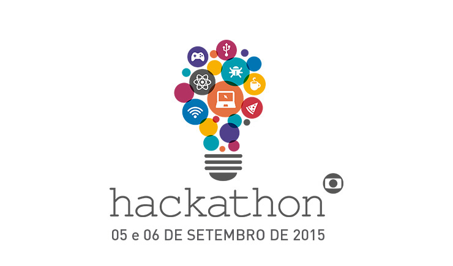

# Hackathon Globo
O primeiro hackathon da Rede Globo ocorreu nos dias 5 e 6 de setembro de 2015, na casa do Big Brother Brasil. Foram ao todo 40 participantes, selecionados cuidadosamente entre quase 2000 inscritos.

Esse repositório tem como finalidade informar os projetos participantes, quais tecnologias foram utilizadas nos mesmos e quem são os autores que desenvolveram tais aplicações.

## Grupo 4
#### Minha Globo
Descrição: Uma plataforma que oferece uma experiência única e personalizada para o telespectador. Usando Big Data, ela cria um perfil para cada usuário do aplicativo e personaliza a programação da Globo de maneira exclusiva, numa timeline que reúne apenas o conteúdo que aquele usuário achará interessante.

Apresentação: https://speakerdeck.com/joselitojunior/minha-globo-number-hackathonglobo

| Nome | Função | Redes | Github |
| ------------- | ------------- | ------------- | ------------- | 
|  Alda Rocha  | Designer  | Twitter, Linkedin | @mjcoffeholick |
|  Adjamilton Júnior  | Backend  | Twitter, Linkedin | ajunior |
|  Gabriel Ilharco  | Backend/Frontend  | Twitter, Linkedin | @gabrielilharco |
|  Joselito Júnior | Frontend  | Twitter, Linkedin | @joselitojunior |
|  Yelken Gonzales | Backend/BigData  | Twitter, Linkedin | @yelken |